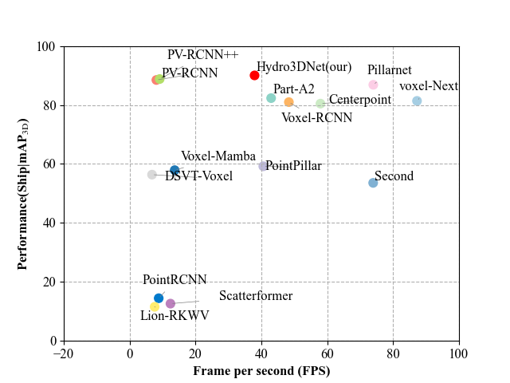

# Hydro3DNet: Spatial-Attention Transformers for Hydrology-Aware Point Clouds

This repo is the official implementation of our paper [Hydro3DNet: Spatial-Attention Transformers for Hydrology-Aware Point Clouds](-). Hydro3DNet is an end-to-end multimodal 3D object detection framework specifically designed for fixed waterway environments. 

**Highlights**: 
-[25-09-06] Code of TROUT is released (SOTA).  

## Changelog
[2025-09-06] `Hydro3DNet` v0.1.0 is released. 
[2025-12-30] Added support for the `FSHNet` baseline (configs and training scripts included).


## Introduction
Hydro3DNet integrates hydrological information with LiDAR point clouds through an attention-based Transformer mechanism to enhance feature representation and improve detection performance.:
1)The proposed framework introduces a Hydro Augmented Voxel Feature Encoding (VFE) module, which embeds dynamic hydrological perception and boundary point augmentation strategies to enrich the spatial geometry features of waterway targets. 
2)A Hydro Former Head module utilizes spatial attention and a Transformer point cloud encoder to integrate Bird's-Eye-View (BEV) features with region-of-interest (RoI) point clouds, enabling high-precision object detection in complex water scenes. 
3)Extensive experiments on the publicly available TROUT dataset demonstrate that Hydro3DNet achieves state-of-the-art performance. On the NVIDIA RTX 4080 GPU, the Ship detection accuracy Ship|mAP3D of Hydro3DNet reaches 91.7%, and the inference speed is 37.9 Hz.

* Renderings of Different Models
<p align="center">
    
</p>

## 🏆Main Results
#### TROUT Dataset

Test set
|                                             | Present at | Stages | Speed(HZ) | Training time | Ship mAP_3D (test) | Infra mAP_3D (test) | download | 
|---------------------------------------------|----------:|:-------:|:-------:|:-------:|:---------:|:-------:|:-------:|
| [SECOND](tools/cfgs/trout_models/second.yaml)       |  Sensors’18  | one | 73.9 | 2.2 | 51.6 | 98.6 | [second_trout_64M](https://drive.google.com/file/d/1jsgBfjvD0Aa7_ywrZR7-zrOrc_WK_Yjz/view?usp=sharing) |
| [PointPillar](tools/cfgs/trout_models/pointpillar.yaml)       |  CVPR’19  | one | 40.5 | 12.1 | 61.6 | 99.4 | [pointpillar_trout_59M](https://drive.google.com/file/d/1jsgBfjvD0Aa7_ywrZR7-zrOrc_WK_Yjz/view?usp=sharing) |
| [PointRCNN](tools/cfgs/trout_models/pointrcnn.yaml)       |  CVPR’19   | one | 8.8 | 15.2 | 11.9 | 98.1 | [pointrcnn_trout_48M](https://drive.google.com/file/d/1pvb9EPo3_H8-UnSLmZJdWA2UHRSIM_7j/view?usp=sharing) |
| [Part-A2](tools/cfgs/trout_models/PartA2.yaml)       |  TPAMI’20  | one | 42.9 | 8.2 | 87.6 | 99.9 | [PartA2_trout_766M](https://drive.google.com/file/d/19o4-mUYY5On1JtDl-NRErhAbzl6-5ex4/view?usp=sharing) |
| [PV-RCNN](tools/cfgs/trout_models/pv_rcnn.yaml)       |  CVPR’20  | two | 9.1| 25.1 | 88.1 | 99.8 | [pv_rcnn_trout_158M](https://drive.google.com/file/d/11ld6ZocQq39RsFXT_AO4-qH0Qg38XDxd/view?usp=sharing) |
| [CenterPoint](tools/cfgs/trout_models/centerpoint.yaml)       |  CVPR’21  | one | 57.9 | 0.9 | 84.5 | 99.9 | [centerpoint_trout_94M](https://drive.google.com/file/d/1HTjo-tgx9FAgt-r7qa1HQC6PZVeHxZyH/view?usp=sharing) |
| [Voxel-RCNN](tools/cfgs/trout_models/voxel_rcnn.yaml)       |  AAAI’21 | two | 48.3 | 8.3 | 85.9 | 99.8 | [voxel_rcnn_trout_89M](https://drive.google.com/file/d/16AIiDPQ5LtXAHIqoRkFwQwCbbk7r7ope/view?usp=sharing) |
| [ST3D-SecondIOU](tools/cfgs/trout_models/second_iou.yaml)       |  CVPR’21  | two | 66.0 | 6.1 | 69.9 | 99.7 | [second_iou_trout_144M](https://drive.google.com/file/d/1LueH43qkrOEObVPXwBzm5BjFzMOXc6Sh/view?usp=sharing) |
| [PV-RCNN++](tools/cfgs/trout_models/pv_rcnn_plusplus.yaml)       |  IJCV’22   | two | 12.4 | 44.9 | 88.5 | 99.9 | [pv_rcnn_plusplus_trout_169M](https://drive.google.com/file/d/1kCMnxVuFaLpKpMWynIiBbFY7-WKGXwyY/view?usp=sharing) |
| [PillarNet](tools/cfgs/trout_models/pillarnet.yaml)       |  ECCV’22  | one | 73.9 | 10.5 | 88.1 | 99.8 | [pillarnet_trout_169M](https://drive.google.com/file/d/1-aJIIm57NVQayoL8dVOHsp0RsvEVvoi4/view?usp=sharing) |
| [VoxelNext](tools/cfgs/trout_models/voxelnext.yaml)       |  CVPR’23  | one | 87.2| 3.9 | 85.7 | 99.9 | [voxelnext_trout_89M](https://drive.google.com/file/d/1cKq2eZvMW33U9FSmL-Mww67_X5cTREF6/view?usp=sharing) |
| [DSVT-Voxel](tools/cfgs/trout_models/dsvt_voxel.yaml)       |  CVPR’23  | one | 6.8 | 62.4 | 54.7 | 95.5 | [dsvt_voxel_trout_99M](https://drive.google.com/file/d/1ogt1wMTLQ1vDvJhzAiHGpQztLJH6wF_9/view?usp=sharing) |
| [Lion-RWKV](tools/cfgs/trout_models/second_with_lion_rwkv_64dim)       |  NeurIPS’24  | one | 7.6 | 86.9 | 5.5 | 94.7 | [second_with_lion_rwkv_64dim_trout_104M](https://drive.google.com/file/d/1j6-VIsT_YAJLACLVLMxmxSK5cilgEnfV/view?usp=sharing) |
| [Voxel-Mamba](tools/cfgs/trout_models/voxel_mamba.yaml)       |  NeurIPS’24  | one | 13.6 | 22.9 | 57.8 | 96.2 | [voxel_mamba_trout_252M](https://drive.google.com/file/d/1iIUocUJk-ijk2JOZxjbNGxWS-DdOtE3L/view?usp=sharing) |
| [ScatterFormer](tools/cfgs/trout_models/scatterformer)       |  ECCV’24   | one | 12.4 | 12.7 | 7.4 | 95.4 | [scatterformer_trout_147M](https://drive.google.com/file/d/13auzDMeYQdSX8laIPZ7foJJTVabzRPgs/view?usp=sharing) |
| [ScatterFormer](tools/cfgs/trout_models/scatterformer.yaml)       |  ECCV’24   | one | 12.4 | 12.7 | 7.4 | 95.4 | [scatterformer_trout_147M](https://drive.google.com/file/d/13auzDMeYQdSX8laIPZ7foJJTVabzRPgs/view?usp=sharing) |
| [FSHNet](tools/cfgs/trout_models/scatterformer.yaml)       |  CVPR’25   | one | 16.6 | 16.5 | 29.2 | 25.7 | [fshnet_trout_132M](https://drive.google.com/file/d/1ainrTYCQjtpjnowCYPEuQRGNsW3c54Rk/view?usp=sharing) |
| [Hydro3DNet(our)](tools/cfgs/trout_models/hydro3Dnet.yaml)       |  -   | two | 37.9 | 12.5 | 91.7 | 99.9 | [hydro3Dnet_trout_197M](https://drive.google.com/file/d/1qNigiWF-3736sJ2FXcMmpVMW4iROBqnw/view?usp=sharing) |


Hydro3DNet achieves state-of-the-art performance. 
On the NVIDIA RTX 4080 GPU, the Ship detection accuracy Ship|mAP3D of Hydro3DNet reaches 91.7%, and the inference speed is 37.9 Hz.
We hope that our Hydro3DNet can provide a potential group-free solution for efficiently handling sparse point clouds for 3D tasks.
<div align="left">
  
</div>

## 🚀Usage
### Installation
Please refer to [INSTALL.md](docs/INSTALL.md) for installation.

### Dataset Preparation
Please follow the instructions from [GETTING_STARTED.md](docs/GETTING_STARTED.md). We adopt the same data generation process.

### Generate Hilbert Template
```
cd data
mkdir hilbert
python ./tools/hilbert_curves/create_hilbert_curve_template.py
```
You can also download Hilbert Template files from [Google Drive](https://drive.google.com/file/d/1Bts6Jt-GCcLtF27BoH8uRtAjdHvwmrf2/view?usp=sharing) or [BaiduYun](https://pan.baidu.com/s/1I9xTjR7PbKRFkbwiLJN2tQ)(code: kubf).

### Training
In addition to Hydro3DNet, we are also integrating other models that emerged in the effect comparison of the papers (for example, DSVT, LION, Voxel-Mama...).


```one-gpu training
cd tool/
python train.py ${CONFIG_FILE} 
```

Give an example.

```
# 
cd tools
python train.py --cfg_file ./cfgs/trout_models/hydro3Dnet.yaml
```

```
# multi-gpu training
cd tools
bash scripts/dist_train.sh 8 --cfg_file ./cfgs/trout_models/hydro3Dnet.yaml 
```

/home/luxiaodong/Hydro3DNet-github/tools/cfgs/trout_models/hydro3Dnet.yaml

### Test

```
# one-gpu testing
cd tools
python test.py --cfg_file ${CONFIG_FILE} --batch_size ${BATCH_SIZE} --ckpt ${CKPT}
```
Give an example.

```shell
python test.py  --cfg_file ./cfgs/trout_models/hydro3Dnet.yaml --batch_size 1 --ckpt ../output//cfgs/trout_models/hydro3Dnet/default/ckpt/latest_model.pth 
```

```
# multi-gpu testing
cd tools
bash scripts/dist_test.sh 8 --cfg_file <CONFIG_FILE> --ckpt <CHECKPOINT_FILE>
```

## Citation
Please consider citing our work as follows if it is helpful.
```
@misc{trout2025,
    title={Hydro3DNet: Spatial-Attention Transformer Networks for Joint Modeling of Hydrological Features and Point Clouds in Complex Waterway Environments},
    author={Xiaodong Lu, Sudong Xu},
    howpublished = {\url{https://github.com/serendipitylxd/Hydro3DNet}},
    year={2025}
}
```

## Acknowledgments
Hydro3DNet is based on [OpenPCDet](https://github.com/open-mmlab/OpenPCDet).  
We also thank the CenterPoint, TransFusion, OctFormer, Mamba, and … authors for their efforts.


