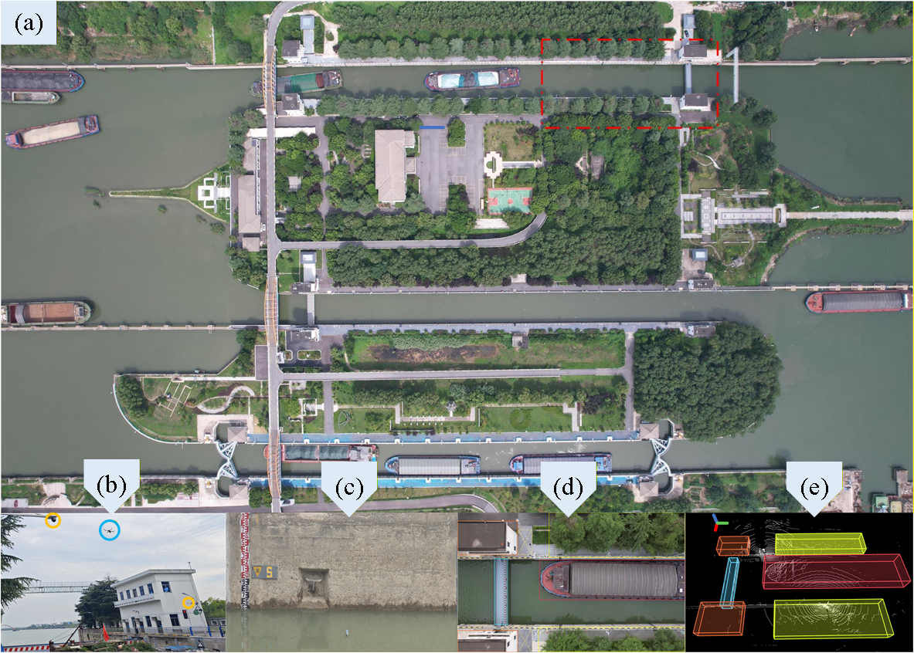
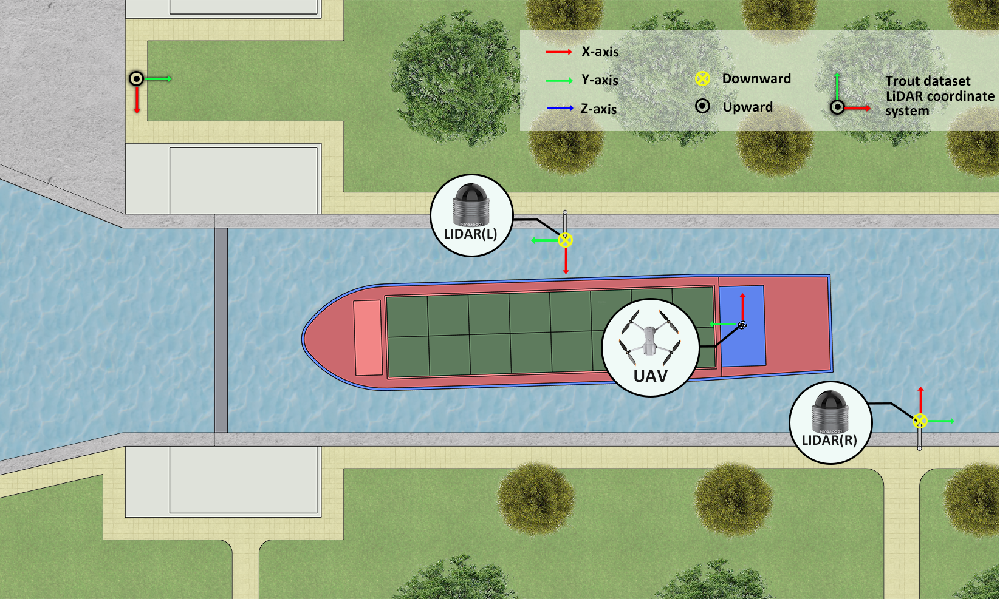

# TROUT Dataset Documentation

## Overview

TROUT (Traffic Recognition in Organized Waterway using multimodal
sensing) is a multimodal fixed-site waterway perception dataset for 3D
object detection in inland navigation environments.

The dataset provides synchronized LiDAR point clouds, UAV images, 3D
bounding box annotations, water-level measurements, and temporal
metadata.

## Dataset Overview

TROUT was collected at the Shiqiao Navigation Lock, Yangzhou, Jiangsu
Province, China.

  Item                Description
  ------------------- ---------------------------------------
  Total frames        16,000
  Training frames     6,000
  Validation frames   2,000
  Testing frames      8,000
  Sensors             LiDAR + UAV + water-level measurement
  Collection period   July 17--19, 2024

## Data Acquisition Setup

Two RoboSense Bpearl LiDAR sensors are deployed on both banks of the
lock chamber in a back-to-back configuration. A DJI Air 2S UAV provides
top-view visual observations, and water-level measurements are
synchronized with LiDAR frames.

## Sensor Specifications

### LiDAR: RoboSense Bpearl

  Parameter                  Specification
  -------------------------- -------------------------
  Laser beams                32
  Range                      100 m (30 m @ 10% NIST)
  Accuracy                   1 cm
  Horizontal field of view   360°
  Vertical field of view     90°
  Frame rate                 5 / 10 / 20 Hz

### UAV: DJI Air 2S

  Parameter          Specification
  ------------------ -------------------------
  Weight             595 g
  Flight time        31 min
  GNSS               GPS + GLONASS + GALILEO
  Camera             5.4K
  Video resolution   5472 × 3078

## Coordinate System

The dataset provides a unified LiDAR coordinate system after extrinsic
calibration.

-   X-axis: forward direction
-   Y-axis: lateral direction
-   Z-axis: vertical direction

## Dataset Structure

    TROUT/
    ├── training/
    ├── validation/
    ├── testing/
    └── metadata/
        ├── add_info_training.txt
        └── add_info_testing.txt

Each sample contains LiDAR point clouds, UAV images, annotations,
timestamps, and water-level information.

## Annotation Format

TROUT provides 3D bounding box annotations:

-   category label
-   3D position
-   object size
-   heading angle

Categories:

-   Building
-   Tree
-   Lock gate
-   Fully loaded cargo ship
-   Fully loaded container ship
-   Unladen cargo ship

## Hydrological Information

Each frame contains synchronized hydrological metadata:

  Field         Description
  ------------- --------------------------
  Timestamp     Acquisition time
  Water level   Water-surface elevation
  Time period   Acquisition period index

Water-level information can be used as an auxiliary physical prior for
multimodal perception.
